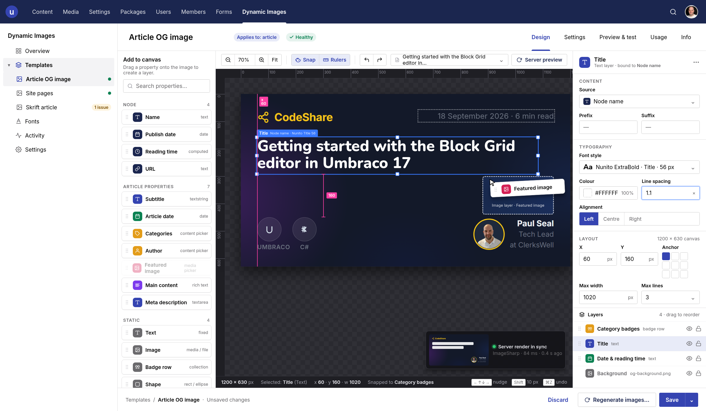
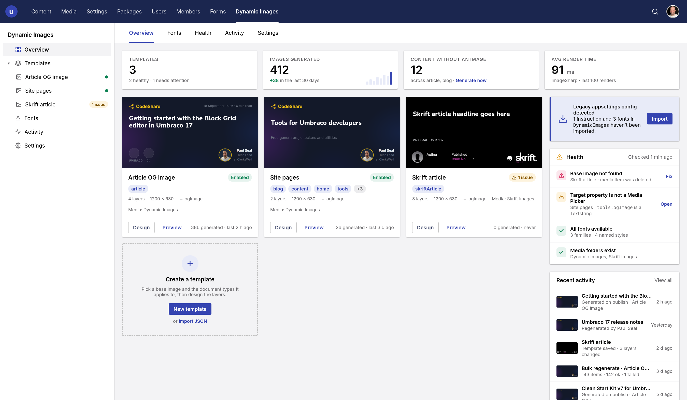
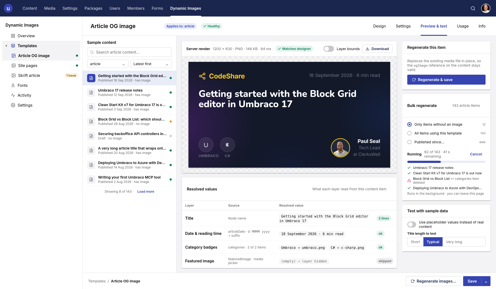
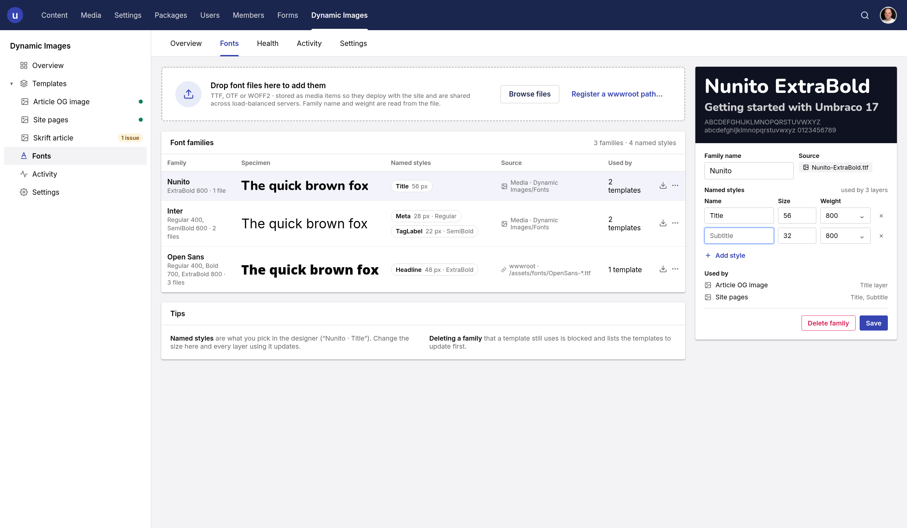

# Dynamic Images for Umbraco

[](https://www.nuget.org/packages/Umbraco.Community.DynamicImages/)
[](https://www.nuget.org/packages/Umbraco.Community.DynamicImages)
[](../LICENSE)

Generate Open Graph / social share images from your content automatically, and design them in the
backoffice instead of writing configuration by hand.

When an editor publishes a page, Dynamic Images composites your text, images and category badges
over a base image, saves the result to the media library, and sets it on the page's media picker -
all within the publish that is already running. What gets drawn is a **template**: a canvas and a
stack of layers you build by dragging properties onto an artboard.



## Installation

Add the package to an existing Umbraco website (v17+) from NuGet:

```
dotnet add package Umbraco.Community.DynamicImages
```

On first start the package creates two tables, installs a media type for font files, and - if there
is a v1 `DynamicImages` block in your configuration - imports it.

Then grant the section: **Users → User Groups → (your group) → Sections → Dynamic Images**. Nobody
sees the section until you do, including administrators.

## Getting started

1. **Add a font.** Dynamic Images → Fonts → *Add a font*. Text layers cannot render without one.
2. **Create a template.** Dynamic Images → Templates → *Create template*.
3. **In Settings**, choose the document types it applies to and the media picker property the
   generated image should be written to.
4. **In Design**, pick a base image, then drag properties from the left onto the canvas.
5. **In Preview & test**, pick a real page and check the render.
6. Publish a page of that type. The image is generated and attached.





## Documentation

Full documentation - layer types, anchored and relative positioning, badge layout, text bindings,
overflow handling, permissions, configuration, Umbraco Cloud notes and **migrating from v1** - is in
[the package README](../src/DynamicImages/README.md), which is also what ships on NuGet.

Release notes are in [the changelog](../src/DynamicImages/CHANGELOG.md).

## Repository layout

| Path | What it is |
|---|---|
| `src/DynamicImages` | The package itself |
| `src/DynamicImages/Client` | The backoffice client (Lit + Vite). The built bundle is committed under `wwwroot/App_Plugins` |
| `src/DynamicImages.TestSite` | An Umbraco 17 site for trying the package out - see [its README](../src/DynamicImages.TestSite/README.md) |
| `test/DynamicImages.Tests` | Unit tests for the renderer, text fitting and layout |

## Building

```
dotnet build src/DynamicImages.sln
dotnet test src/DynamicImages.sln
```

To rebuild the backoffice client:

```
cd src/DynamicImages/Client
npm ci
npm run build      # writes ../wwwroot/App_Plugins/DynamicImages
npm run typecheck
npm test
```

That build output is committed, so commit it alongside the source change that produced it.

## Contributing

Contributions to this package are most welcome! Please read the
[Contributing Guidelines](CONTRIBUTING.md).

## Acknowledgments

Built by [Paul Seal](https://github.com/prjseal). Image compositing by
[SixLabors.ImageSharp.Drawing](https://github.com/SixLabors/ImageSharp.Drawing).
