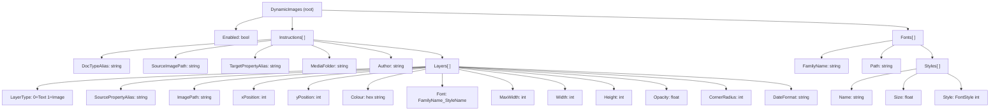

# Configuration Reference

All configuration lives under the `DynamicImages` key in `appsettings.json` (or any environment-specific override such as `appsettings.Development.json`).

---

## Configuration Structure



---

## Top-Level Properties

| Property | Type | Required | Default | Description |
|----------|------|----------|---------|-------------|
| `Enabled` | `bool` | No | `false` | Master switch. Set to `true` to activate the package. |
| `Instructions` | `Instruction[]` | Yes | — | One entry per document type that should trigger image generation. |
| `Fonts` | `FontConfig[]` | Yes | — | Font families available to text layers. |

---

## `Instructions` Properties

Each entry in the `Instructions` array targets one Umbraco document type.

| Property | Type | Required | Description |
|----------|------|----------|-------------|
| `DocTypeAlias` | `string` | Yes | The alias of the Umbraco document type that triggers image generation when published. |
| `SourceImagePath` | `string` | Yes | Site-relative path to the base image (e.g. `/assets/background.png`). All layers are composited on top of this. |
| `TargetPropertyAlias` | `string` | Yes | The alias of the media-picker property on the content node where the generated image UDI will be saved. |
| `MediaFolder` | `string` | Yes | Name of the media library folder where generated images are saved (created automatically if absent). |
| `Author` | `string` | No | `""` | Author name stored on the created media item. |
| `Layers` | `Layer[]` | Yes | Ordered list of layers to composite onto the base image. |

> **Note:** Image generation only runs when the `TargetPropertyAlias` property is empty or null. Publishing content that already has a generated image does not overwrite it.

---

## `Layers` Properties

Layers are applied in declaration order — later layers render on top of earlier ones.

### Common Properties (all layer types)

| Property | Type | Required | Description |
|----------|------|----------|-------------|
| `LayerType` | `int` | Yes | `0` = Text layer, `1` = Image layer. |
| `SourcePropertyAlias` | `string` | Conditional | Content property alias to read the value from. For text layers this is the text value; for image layers this resolves a media picker to a file path. Use `name` to read the node name. |
| `xPosition` | `int` | Yes | Horizontal pixel offset from the left edge of the base image. |
| `yPosition` | `int` | Yes | Vertical pixel offset from the top edge of the base image. |

### Text Layer Properties (`LayerType: 0`)

| Property | Type | Required | Description |
|----------|------|----------|-------------|
| `Colour` | `string` | Yes | Hex colour string (e.g. `#ffffff` or `#c13ea9`). |
| `Font` | `string` | Yes | Font identifier in the format `{FamilyName}_{StyleName}` (e.g. `OpenSans_Large`). Must match a configured font and style. |
| `MaxWidth` | `int` | No | When set, text wraps at this pixel width. Omit or set to `0` for single-line rendering. |
| `DateFormat` | `string` | No | When the source property is a date, applies this .NET format string (e.g. `dd MMM yyyy`). |

### Image Layer Properties (`LayerType: 1`)

| Property | Type | Required | Description |
|----------|------|----------|-------------|
| `ImagePath` | `string` | Conditional | Site-relative path to a static image (e.g. `/assets/logo.png`). Use this **or** `SourcePropertyAlias`, not both. |
| `Width` | `int` | No | Target width in pixels. If omitted, the image is not resized horizontally. |
| `Height` | `int` | No | Target height in pixels. If omitted, the image is not resized vertically. |
| `Opacity` | `float` | No | Opacity from `0.0` (transparent) to `1.0` (fully opaque). Defaults to `1.0`. |
| `CornerRadius` | `int` | No | Rounds the corners of the image. Set equal to half of `Width`/`Height` for a perfect circle (e.g. `Width: 100`, `Height: 100`, `CornerRadius: 50`). |

---

## `Fonts` Properties

| Property | Type | Required | Description |
|----------|------|----------|-------------|
| `FamilyName` | `string` | Yes | Logical name for the font family (used to build the `Font` reference on a layer). |
| `Path` | `string` | Yes | Site-relative path to the `.ttf` font file (e.g. `/assets/fonts/OpenSans-Regular.ttf`). |
| `Styles` | `SizeAndStyle[]` | Yes | Named size and style variants. |

### `Styles` Properties

| Property | Type | Required | Description |
|----------|------|----------|-------------|
| `Name` | `string` | Yes | Logical name for this style (e.g. `Small`, `Large`). Combined with `FamilyName` to form the layer `Font` value: `{FamilyName}_{Name}`. |
| `Size` | `float` | Yes | Font size in points. |
| `Style` | `int` | No | `FontStyle` enum value: `0` = Regular, `1` = Bold, `2` = Italic, `3` = BoldItalic. Defaults to `0`. |

### Font Reference Convention

To reference a font in a text layer, combine `FamilyName` and style `Name` with an underscore:

```
Font: "{FamilyName}_{StyleName}"
```

**Example:** A font with `FamilyName: "OpenSans"` and a style `Name: "Large"` is referenced as `"OpenSans_Large"`.

---

## Full Annotated Example

```json
{
  "DynamicImages": {
    "Enabled": true,

    "Instructions": [
      {
        "DocTypeAlias": "blogPost",
        "SourceImagePath": "/assets/social-background.png",
        "TargetPropertyAlias": "socialImage",
        "MediaFolder": "Social Images",
        "Author": "Website",
        "Layers": [
          {
            // Text layer: node name, large white text with wrapping
            "LayerType": 0,
            "SourcePropertyAlias": "name",
            "xPosition": 60,
            "yPosition": 80,
            "Colour": "#ffffff",
            "Font": "OpenSans_Large",
            "MaxWidth": 700
          },
          {
            // Text layer: author name, smaller coloured text
            "LayerType": 0,
            "SourcePropertyAlias": "authorName",
            "xPosition": 60,
            "yPosition": 420,
            "Colour": "#c13ea9",
            "Font": "OpenSans_Small"
          },
          {
            // Text layer: publish date formatted as "09 Apr 2026"
            "LayerType": 0,
            "SourcePropertyAlias": "publishDate",
            "DateFormat": "dd MMM yyyy",
            "xPosition": 60,
            "yPosition": 470,
            "Colour": "#cccccc",
            "Font": "OpenSans_Small"
          },
          {
            // Image layer: static logo in bottom-right corner, semi-transparent
            "LayerType": 1,
            "ImagePath": "/assets/logo.png",
            "Width": 120,
            "Height": 120,
            "Opacity": 0.9,
            "xPosition": 860,
            "yPosition": 440
          },
          {
            // Image layer: circular author avatar from content media picker property
            "LayerType": 1,
            "SourcePropertyAlias": "authorAvatar",
            "Width": 100,
            "Height": 100,
            "CornerRadius": 50,
            "Opacity": 1.0,
            "xPosition": 60,
            "yPosition": 400
          }
        ]
      }
    ],

    "Fonts": [
      {
        "FamilyName": "OpenSans",
        "Path": "/assets/fonts/OpenSans-Regular.ttf",
        "Styles": [
          {
            "Name": "Small",
            "Size": 30,
            "Style": 0
          },
          {
            "Name": "Large",
            "Size": 80,
            "Style": 0
          }
        ]
      }
    ]
  }
}
```

---

## Environment-Specific Configuration

Use `appsettings.Development.json` to override settings during local development without changing production values:

```json
{
  "DynamicImages": {
    "Enabled": true,
    "Instructions": [
      {
        "DocTypeAlias": "blogPost",
        "SourceImagePath": "/assets/dev-background.png",
        "TargetPropertyAlias": "socialImage",
        "MediaFolder": "Dev Social Images",
        "Author": "Dev",
        "Layers": []
      }
    ]
  }
}
```

> Standard .NET configuration merging applies — properties defined in environment-specific files override their equivalents in `appsettings.json`.
