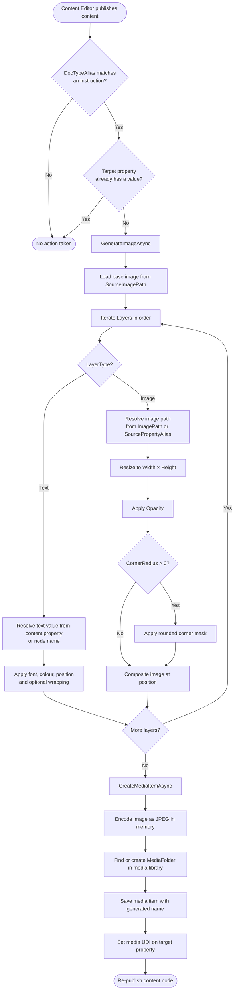
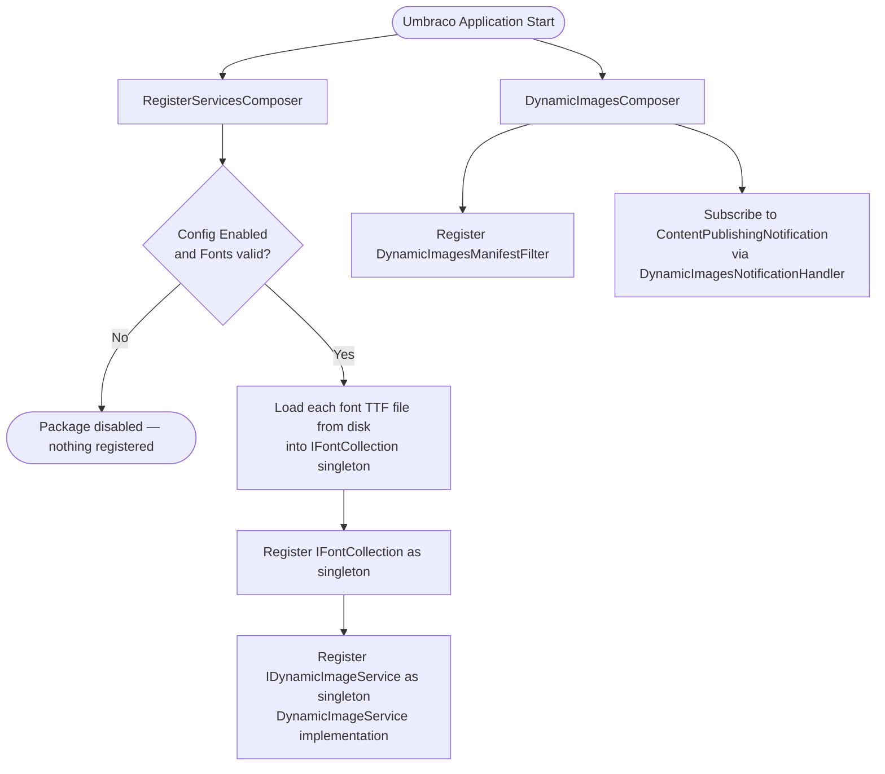

# How It Works

`Umbraco.Community.DynamicImages` automatically generates social-media preview images (Open Graph images, blog headers, podcast covers, etc.) by compositing configurable layers onto a base image whenever matching content is published in Umbraco.

---

## Package Purpose

When a content editor publishes a page, this package:

1. Detects the publish event via Umbraco's notification system.
2. Checks whether the published content type has a matching generation instruction.
3. Composites text and image layers onto a base image using [SixLabors ImageSharp](https://sixlabors.com/products/imagesharp/).
4. Saves the result as a JPEG in the Umbraco media library.
5. Writes the media UDI back to the content node and re-publishes, so the image is immediately available to editors.

No manual intervention is required after the initial configuration.

---

## End-to-End Flow



---

## Layer Compositing Process

Each layer is applied in the order it is declared in configuration. Later layers render on top of earlier ones.


---

## Key Classes

| Class | Location | Responsibility |
|-------|----------|----------------|
| `DynamicImagesComposer` | `Composing/` | Registers the package manifest and notification handler with Umbraco |
| `RegisterServicesComposer` | `Composing/` | Loads fonts from disk and registers `IDynamicImageService` as a singleton |
| `DynamicImagesNotificationHandler` | `NotificationHandlers/` | Listens for `ContentPublishingNotification` and orchestrates image creation |
| `DynamicImageService` | `Services/` | Core service — generates images and saves them to the media library |
| `IDynamicImageService` | `Services/` | Interface that `DynamicImageService` implements |
| `DynamicImagesConfig` | `Config/` | Strongly-typed root configuration bound from `appsettings.json` |
| `Instruction` | `Models/` | Defines one image-generation job (doctype → layers → target property) |
| `Layer` | `Models/` | Defines a single text or image layer |
| `FontConfig` | `Models/` | Defines a font family and its named size/style variants |
| `ImageProcessingContextExtensions` | `Extensions/` | Provides rounded-corner and avatar helper methods |

---

## Dependency Injection Setup



### What happens if fonts are missing?

`RegisterServicesComposer` checks that each font file exists on disk before registering the service. If any font is missing, or if `Enabled` is `false`, the service is not registered and the notification handler never fires — failing silently rather than crashing the site.

---

## Media Library Organisation

Generated images are stored under the folder name specified by `MediaFolder` in each instruction. If two content items produce an image with the same file name, the package creates a sub-folder rather than overwriting the existing file:

```
Media Library
└── Generated Images/          ← MediaFolder value
    ├── my-blog-post.jpg
    ├── my-blog-post/          ← sub-folder created for duplicate name
    │   └── my-blog-post.jpg
    └── another-post.jpg
```

---

## Technology Stack

| Concern | Library |
|---------|---------|
| Image compositing | `SixLabors.ImageSharp.Drawing` |
| Font rendering | `SixLabors.Fonts` |
| Memory efficiency | `Microsoft.IO.RecyclableMemoryStream` |
| CMS integration | `Umbraco.Cms.Web.Website` / `Umbraco.Cms.Web.BackOffice` v13+ |
| Target framework | .NET 8.0 |
