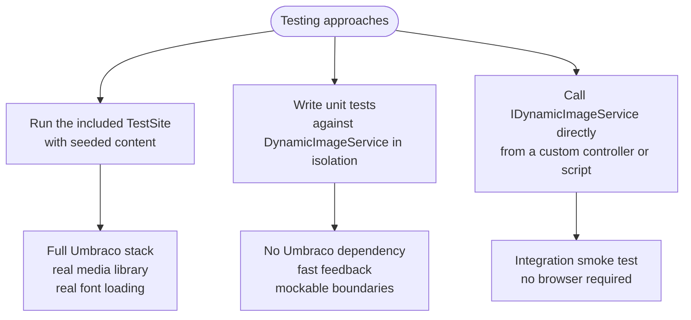
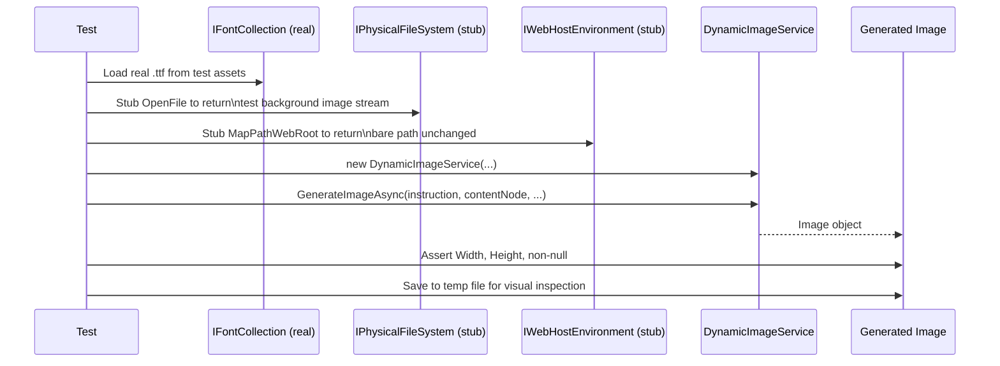

# Testing Without the UI

This guide explains how to run, verify, and test `Umbraco.Community.DynamicImages` without relying on the Umbraco backoffice.

---

## Overview

There are three testing approaches available:



---

## Approach 1: Run the Test Site

The repository includes a ready-to-run Umbraco test site at `src/DynamicImages.TestSite/`.

### What the test site provides

- A pre-configured Umbraco 13 instance with SQLite (no SQL Server required).
- An `appsettings.Development.json` with a fully configured `DynamicImages` section.
- uSync content definitions for an `issue` document type with `socialImage`, `title`, `author`, `issueNumber`, and `publishDate` properties.
- Sample assets: background image, logo overlay, avatar, and OpenSans font.

### Running the test site

```bash
cd src/DynamicImages.TestSite
dotnet run
```

Umbraco will start at `https://localhost:44391` (or the port in `launchSettings.json`).

### Triggering image generation without a browser

Once the site is running, use a plain HTTP call to publish a content node via the Umbraco Content Delivery API or the Management API. Alternatively, publish from the Umbraco backoffice.

Image generation happens on `ContentPublishingNotification`, so any publish — UI or API — will trigger it.

### Verifying the result

Check the media library folder named after `MediaFolder` in your config. A JPEG file matching the content node name should appear. Inspect it directly from the file system:

```
src/DynamicImages.TestSite/umbraco/Data/TEMP/MediaUploads/
```

Or query it via the Umbraco Management API:

```
GET /umbraco/management/api/v1/media?skip=0&take=10
```

---

## Approach 2: Unit Testing DynamicImageService

`DynamicImageService` depends on several Umbraco services, but `GenerateImageAsync()` only needs `IPhysicalFileSystem`, `IWebHostEnvironment`, and loaded fonts to function. These can all be substituted with test doubles.

### Project setup

Create a new xUnit test project:

```bash
dotnet new xunit -n DynamicImages.Tests
cd DynamicImages.Tests
dotnet add reference ../DynamicImages/DynamicImages.csproj
dotnet add package NSubstitute
dotnet add package SixLabors.ImageSharp
dotnet add package SixLabors.Fonts
dotnet add package Microsoft.AspNetCore.TestHost
```

### Test workflow



### Example: Testing text layer rendering

```csharp
using DynamicImages.Config;
using DynamicImages.Models;
using DynamicImages.Services;
using Microsoft.AspNetCore.Hosting;
using Microsoft.Extensions.Options;
using NSubstitute;
using SixLabors.Fonts;
using SixLabors.ImageSharp;
using SixLabors.ImageSharp.PixelFormats;
using Umbraco.Cms.Core.IO;
using Umbraco.Cms.Core.Models;
using Umbraco.Cms.Core.Models.PublishedContent;
using Xunit;

public class DynamicImageServiceTests
{
    private const string TestFontPath = "Assets/OpenSans-Regular.ttf";
    private const string TestImagePath = "Assets/background.png";

    [Fact]
    public async Task GenerateImageAsync_WithTextLayer_ReturnsCorrectDimensions()
    {
        // Arrange
        var config = BuildConfig();
        var (service, _) = BuildService(config);

        var instruction = config.Instructions[0];
        var contentNode = BuildFakeContent("My Test Page");
        var publishedNode = Substitute.For<IPublishedContent>();

        // Act
        using var result = await service.GenerateImageAsync(instruction, contentNode, publishedNode);

        // Assert
        Assert.NotNull(result);
        Assert.Equal(1200, result.Width);
        Assert.Equal(630, result.Height);
    }

    [Fact]
    public async Task GenerateImageAsync_WithTextLayer_CanSaveToFile()
    {
        // Arrange
        var config = BuildConfig();
        var (service, _) = BuildService(config);

        var instruction = config.Instructions[0];
        var contentNode = BuildFakeContent("Hello World");
        var publishedNode = Substitute.For<IPublishedContent>();

        var outputPath = Path.Combine(Path.GetTempPath(), "dynamic-images-test.jpg");

        // Act
        using var result = await service.GenerateImageAsync(instruction, contentNode, publishedNode);
        result.SaveAsJpeg(outputPath);

        // Assert
        Assert.True(File.Exists(outputPath));
        Assert.True(new FileInfo(outputPath).Length > 0);

        // Optionally open for manual inspection:
        // System.Diagnostics.Process.Start(outputPath);
    }

    // ── Helpers ─────────────────────────────────────────────────────────────

    private static DynamicImagesConfig BuildConfig() => new()
    {
        Enabled = true,
        Fonts = new[]
        {
            new FontConfig
            {
                FamilyName = "OpenSans",
                Path = TestFontPath,
                Styles = new[]
                {
                    new SizeAndStyle { Name = "Large", Size = 60 }
                }
            }
        },
        Instructions = new[]
        {
            new Instruction
            {
                DocTypeAlias = "testPage",
                SourceImagePath = TestImagePath,
                TargetPropertyAlias = "socialImage",
                MediaFolder = "Test Images",
                Author = "Test",
                Layers = new[]
                {
                    new Layer
                    {
                        LayerType = LayerType.Text,
                        SourcePropertyAlias = "name",
                        xPosition = 60,
                        yPosition = 80,
                        Colour = "#ffffff",
                        Font = "OpenSans_Large",
                        MaxWidth = 700
                    }
                }
            }
        }
    };

    private static (DynamicImageService service, IFontCollection fonts) BuildService(DynamicImagesConfig config)
    {
        // Load real fonts from test assets
        var fontCollection = new FontCollection();
        fontCollection.Add(TestFontPath);

        // Stub IPhysicalFileSystem to open files by path directly
        var fileSystem = Substitute.For<IPhysicalFileSystem>();
        fileSystem.OpenFile(Arg.Any<string>())
                  .Returns(ci => File.OpenRead(ci.Arg<string>()));

        // Stub IWebHostEnvironment to return paths unchanged
        var webHost = Substitute.For<IWebHostEnvironment>();
        webHost.MapPathWebRoot(Arg.Any<string>())
               .Returns(ci => ci.Arg<string>().TrimStart('/'));

        // Stub the Umbraco services we don't exercise here
        var mediaService      = Substitute.For<IMediaService>();
        var mediaFileManager  = Substitute.For<MediaFileManager>();
        var urlGenerators     = Substitute.For<MediaUrlGeneratorCollection>();
        var shortString       = Substitute.For<IShortStringHelper>();
        var contentTypeBase   = Substitute.For<IContentTypeBaseServiceProvider>();

        var options = Options.Create(config);

        var service = new DynamicImageService(
            fontCollection, fileSystem, webHost,
            mediaService, mediaFileManager, urlGenerators,
            shortString, contentTypeBase, options);

        return (service, fontCollection);
    }

    private static IContent BuildFakeContent(string name)
    {
        var content = Substitute.For<IContent>();
        content.Name.Returns(name);
        return content;
    }
}
```

### Test asset layout

Place a 1200×630 PNG and the `.ttf` file in a `Assets/` folder inside the test project:

```
DynamicImages.Tests/
├── Assets/
│   ├── background.png        ← 1200×630 test background
│   └── OpenSans-Regular.ttf  ← same font as production
├── DynamicImageServiceTests.cs
└── DynamicImages.Tests.csproj
```

Mark them as `CopyToOutputDirectory`:

```xml
<ItemGroup>
  <None Update="Assets\**">
    <CopyToOutputDirectory>PreserveNewest</CopyToOutputDirectory>
  </None>
</ItemGroup>
```

### Running the tests

```bash
dotnet test
```

To visually inspect the output image, temporarily add:

```csharp
result.SaveAsJpeg("/tmp/test-output.jpg");
```

Then open `/tmp/test-output.jpg` with any image viewer.

---

## Approach 3: Smoke Test via a Custom Controller

For integration verification without a browser, add a minimal API endpoint to your Umbraco site that calls `IDynamicImageService.GenerateImageAsync()` and returns the image bytes:

```csharp
using DynamicImages.Config;
using DynamicImages.Models;
using DynamicImages.Services;
using Microsoft.AspNetCore.Mvc;
using Microsoft.Extensions.Options;
using SixLabors.ImageSharp.Formats.Jpeg;

[ApiController]
[Route("api/dynamic-images/test")]
public class DynamicImagesTestController : ControllerBase
{
    private readonly IDynamicImageService _service;
    private readonly DynamicImagesConfig _config;

    public DynamicImagesTestController(IDynamicImageService service, IOptions<DynamicImagesConfig> config)
    {
        _service    = service;
        _config     = config.Value;
    }

    /// <summary>
    /// GET /api/dynamic-images/test/{docTypeAlias}
    /// Returns the generated image as JPEG for visual inspection.
    /// Remove or protect this endpoint in production.
    /// </summary>
    [HttpGet("{docTypeAlias}")]
    public async Task<IActionResult> Preview(string docTypeAlias)
    {
        var instruction = _config.Instructions
            .FirstOrDefault(i => i.DocTypeAlias == docTypeAlias);

        if (instruction is null)
            return NotFound($"No instruction configured for '{docTypeAlias}'");

        // Build a minimal fake content node for preview
        var fakeContent = new FakeContent("Preview Page", docTypeAlias);

        using var image = await _service.GenerateImageAsync(instruction, fakeContent, null!);

        var stream = new MemoryStream();
        await image.SaveAsync(stream, new JpegEncoder());
        stream.Position = 0;

        return File(stream, "image/jpeg");
    }
}
```

Then from a terminal:

```bash
curl -o preview.jpg https://localhost:44391/api/dynamic-images/test/blogPost
open preview.jpg      # macOS
xdg-open preview.jpg  # Linux
```

This lets you iterate on layer configuration and immediately see the result without publishing content.

> **Important:** Remove or protect this endpoint before deploying to production. It bypasses all authentication and content checks.

---

## Troubleshooting

| Symptom | Likely cause | Fix |
|---------|-------------|-----|
| Service not registered, `IDynamicImageService` not resolved | `Enabled: false` or font file path wrong | Check `Enabled: true` and that font `.ttf` file exists at the configured path |
| `ArgumentOutOfRangeException: No fonts loaded` | Font file missing at startup | Verify the `Path` in `Fonts` config points to an existing `.ttf` |
| Image generated but target property not updated | Content already had a value in `TargetPropertyAlias` | Clear the property value and re-publish |
| Text not visible | Wrong `Colour` hex or `Font` key doesn't match `{FamilyName}_{StyleName}` | Check font name convention and colour format |
| Circular avatar not circular | `CornerRadius` not set to half of `Width`/`Height` | For a 100×100 image, set `CornerRadius: 50` |
| Image layer not composited | `SourcePropertyAlias` media picker empty, or `ImagePath` path wrong | Check the property has a media item selected, or verify the static `ImagePath` |
