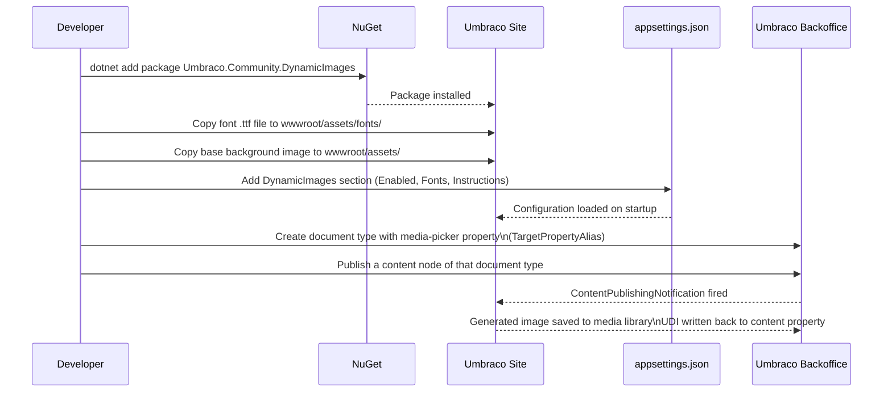

# Usage Guide

This guide walks through installing the package in an Umbraco 13 site and setting it up to automatically generate social-media preview images on content publish.

---

## Prerequisites

- Umbraco 13.7.0 or later (.NET 8)
- At least one `.ttf` font file accessible from your web root
- A base image (PNG or JPG) to use as the canvas background

---

## Setup Sequence



---

## Step 1: Install the Package

```bash
dotnet add package Umbraco.Community.DynamicImages
```

Or via the NuGet Package Manager in Visual Studio.

No additional `Startup.cs` changes are required — the package registers itself through Umbraco's composer system.

---

## Step 2: Add Font Files

Place your `.ttf` font files somewhere under `wwwroot`. The path you use here must match the `Path` value you set in `Fonts` configuration.

Recommended location:

```
wwwroot/
└── assets/
    └── fonts/
        └── OpenSans-Regular.ttf
```

[Google Fonts](https://fonts.google.com/) provides free `.ttf` files for download. Only Regular weight is needed unless you configure Bold or Italic styles.

---

## Step 3: Prepare a Base Image

Create or obtain a background image that matches your desired output dimensions (1200×630 px is the standard Open Graph size). Place it in `wwwroot/assets/`.

```
wwwroot/
└── assets/
    ├── fonts/
    │   └── OpenSans-Regular.ttf
    ├── social-background.png    ← base image
    └── logo.png                 ← optional static overlay
```

---

## Step 4: Configure appsettings.json

Add the `DynamicImages` section to your `appsettings.json`:

```json
{
  "DynamicImages": {
    "Enabled": true,
    "Instructions": [
      {
        "DocTypeAlias": "blogPost",
        "SourceImagePath": "/assets/social-background.png",
        "TargetPropertyAlias": "socialImage",
        "MediaFolder": "Social Images",
        "Author": "Website",
        "Layers": [
          {
            "LayerType": 0,
            "SourcePropertyAlias": "name",
            "xPosition": 60,
            "yPosition": 80,
            "Colour": "#ffffff",
            "Font": "OpenSans_Large",
            "MaxWidth": 700
          }
        ]
      }
    ],
    "Fonts": [
      {
        "FamilyName": "OpenSans",
        "Path": "/assets/fonts/OpenSans-Regular.ttf",
        "Styles": [
          { "Name": "Small", "Size": 30 },
          { "Name": "Large", "Size": 80 }
        ]
      }
    ]
  }
}
```

See the [Configuration Reference](configuration.md) for the full list of available options.

---

## Step 5: Set Up the Document Type

In the Umbraco backoffice:

1. Open or create the document type whose alias matches `DocTypeAlias` (e.g. `blogPost`).
2. Add a **Media Picker** property with an alias matching `TargetPropertyAlias` (e.g. `socialImage`).
3. Save the document type.

The generated image UDI will be written to this property after the first publish.

---

## Step 6: Publish Content

Publish a content node of the configured document type. On first publish (when `socialImage` is empty), the package will:

1. Composite the configured layers onto the base image.
2. Save the result as a JPEG in the **Social Images** media folder.
3. Write the UDI back to the `socialImage` property.
4. Re-publish the content node.

The `socialImage` property will now contain the generated image, ready to use in your templates.

---

## Using the Image in Templates

In a Razor view, render the generated image using the standard media picker pattern:

```csharp
@{
    var socialImage = Model.Value<IPublishedContent>("socialImage");
}

@if (socialImage != null)
{
    <meta property="og:image" content="@socialImage.Url(mode: UrlMode.Absolute)" />
}
```

---

## Common Patterns

### Social Share Card (1200×630)

Typical setup for an Open Graph image:

- Base image: 1200×630 px branded background
- Layer 0: Page title text, top-left, with `MaxWidth: 900` for wrapping
- Layer 1: Author name, lower-left, smaller font
- Layer 2: Static logo, bottom-right, `Opacity: 0.85`

### Blog Header with Circular Avatar

- Layer 0: Article title, bold large font
- Layer 1: Publish date, formatted with `DateFormat: "dd MMM yyyy"`
- Layer 2: Author avatar from `SourcePropertyAlias: "authorImage"`, `CornerRadius: 50` for circular crop

### Podcast / Episode Cover

- Base image: square (1400×1400 px)
- Layer 0: Podcast name
- Layer 1: Episode number
- Layer 2: Episode title with wrapping

---

## Regenerating an Image

Because generation only runs when the target property is empty, to force regeneration:

1. Clear the `socialImage` property value in the backoffice.
2. Save and re-publish the content node.

The package will generate a new image and create a new media item (the old one is not deleted automatically).

---

## Multiple Document Types

Add one entry to `Instructions` per document type:

```json
"Instructions": [
  {
    "DocTypeAlias": "blogPost",
    "TargetPropertyAlias": "socialImage",
    "SourceImagePath": "/assets/blog-bg.png",
    "MediaFolder": "Blog Social Images",
    "Layers": [ ... ]
  },
  {
    "DocTypeAlias": "podcastEpisode",
    "TargetPropertyAlias": "episodeCover",
    "SourceImagePath": "/assets/podcast-bg.png",
    "MediaFolder": "Podcast Covers",
    "Layers": [ ... ]
  }
]
```

Each instruction is evaluated independently on every publish event.
