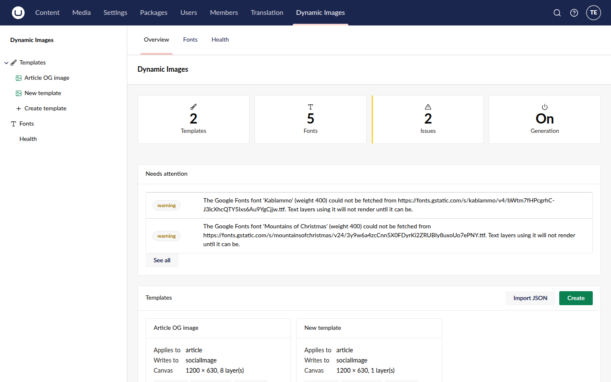
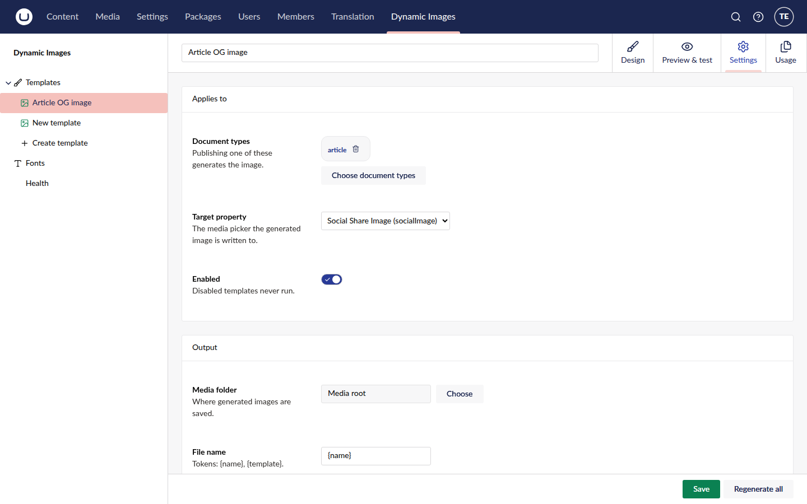
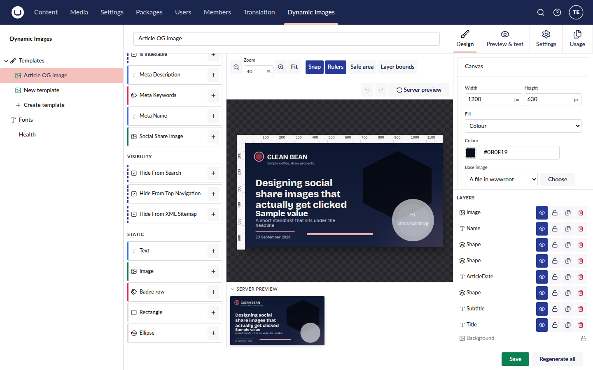
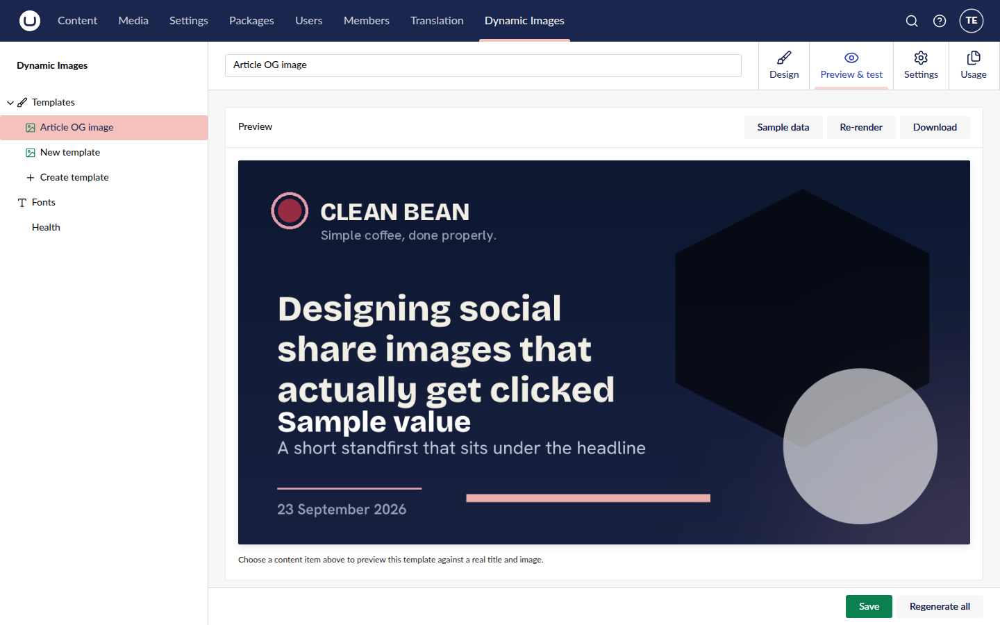
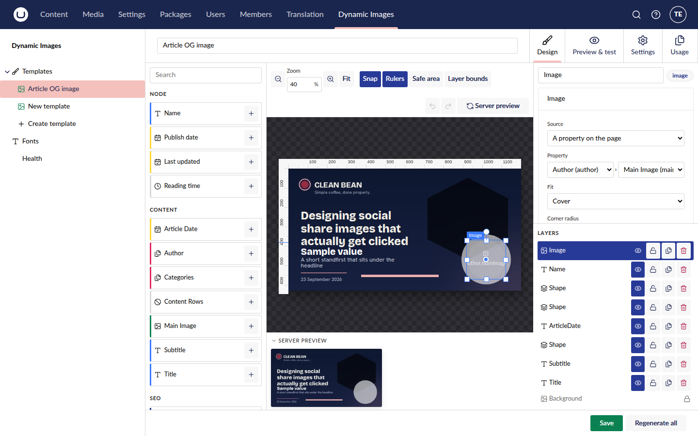
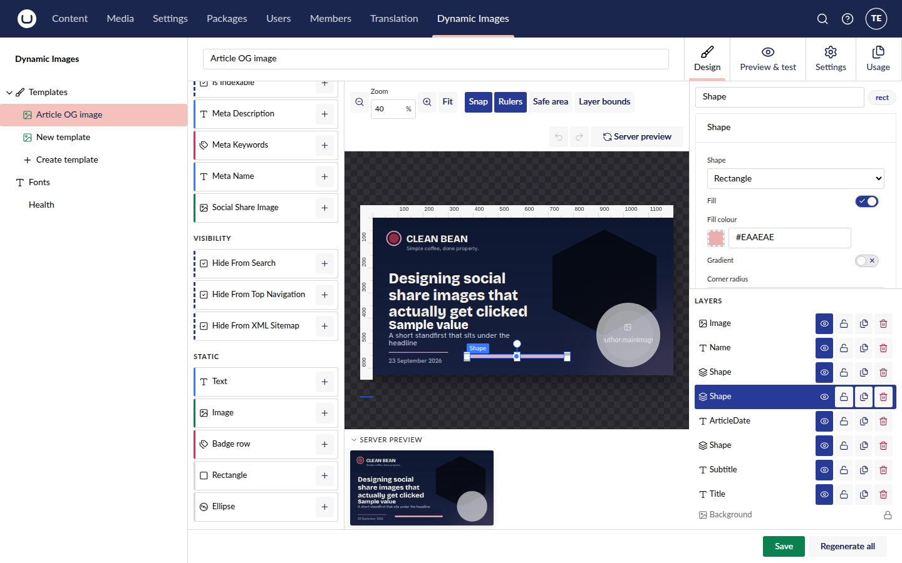

# Native-Umbraco UI overhaul for the Dynamic Images section

## Context

The client uses Umbraco UI (UUI) web components, but not Umbraco backoffice *conventions*. The
section navigation is a hand-built menu, the overview is a custom card list, the pickers render
their selection in custom ways, and the designer's options panels put controls side by side
until they run off-screen. The goal is for the section to feel like native Umbraco 17. Wherever
core already has a pattern — trees, collections, entity actions, pickers, selected-item displays,
colour picker — use the real extension type or core component rather than a lookalike.

This plan covers eight changes (sections 1–8 below), each with its current state, target state,
server-side impact, risks and size. The screenshots under `mockups/before/` were taken from
`src/DynamicImages.TestSite.Clean`, running on this branch on 2026-09-23. **The "after" mock-ups
the brief asked for were not produced in the planning session.** The target states below are
specified in terms of the core components and kinds to use, and each names the core screen that
is the visual reference.

### Decisions made with the user

1. **Document types stay multi-select; only the display changes.** The brief asked for
   single-select, but templates already target several document types: `docTypeAliases: string[]`
   in the model and the `docTypeAliases` column, a multi-select picker, and the README documents
   it. Narrowing it would lose targeting on existing installs. So the picker becomes the native
   `umb-input-document-type`, multi-select, and there is no data change. The brief's future
   "multi-document-type support" is already there. The only remaining future work would be a
   per-document-type target property, if that is ever wanted.
2. **The Overview dashboard stays, without its template list.** The stats tiles and "Needs
   attention" remain as the section's landing dashboard. The Templates box goes, together with its
   *Create* and *Import JSON* buttons: creating moves to the tree, and import becomes an entity
   action on the Templates root and on folders.
3. **Grid cards show a rendered thumbnail**, like Media's grid view. This needs a new server
   endpoint (section 2).

### Facts verified against `@umbraco-cms/backoffice@17.7.0` (the published tarball) and this repo

**Backoffice extension kinds and components.** Paths are under `dist-cms/packages/`.

- **Trees.** The stack is:
  - `repository`
  - `treeStore`
  - `tree` (kind `default`, `meta.repositoryAlias`)
  - `treeItem` (kind `default`, `forEntityTypes` covering the root, item and folder entity types)
  - `menuItem` (kind `tree`, `meta: { treeAlias, menus, hideTreeRoot? }`)

  The base classes are `UmbTreeRepositoryBase` (abstract `requestTreeRoot()`) and
  `UmbTreeServerDataSourceBase`, which takes `{ getRootItems, getChildrenOf, getAncestorsOf,
  mapper }` (`core/tree/data/`). `UmbTreeItemModel` is `{ unique, parent: {unique, entityType},
  entityType, name, hasChildren, isFolder, icon }` (`core/tree/types.d.ts`). The reference
  implementation is `documents/document-types/tree/manifests.js`.
- **Folders.**
  - `entityAction` kinds `folderUpdate` and `folderDelete`, with `meta.folderRepositoryAlias`.
  - `entityCreateOptionAction` kind `folder` (`core/tree/folder/`).
  - A folder repository is `UmbDetailRepositoryBase<UmbFolderModel, …>` over a data source that
    implements `UmbDetailDataSource<UmbFolderModel>`.
  - A folder gets a `workspace` of kind `routable` on its entity type.
  - Reference: `documents/document-types/tree/folder/*`.
- **Create.** An `entityAction` of kind `create`, plus one `entityCreateOptionAction` per option.
  The create action opens the list of options (`documents/document-types/entity-actions/create/`).
- **Other entity action kinds available:** `moveTo` (`meta: { treeRepositoryAlias,
  moveRepositoryAlias, treeAlias }`), `delete`, `duplicate`, `duplicateTo`,
  `reloadTreeItemChildren`, `sortChildrenOf`.
- **Collections.**
  - `collection` (kind `default`, `meta.repositoryAlias`).
  - `collectionView` kinds `table` (`meta.columns: [{ field, label, valueType }]`), `card` and
    `ref` (`core/collection/view/`).
  - `collectionAction` kind `create`.
  - `workspaceView` kind `collection`.
  - The `card` view renders `umb-entity-collection-item-card`, which resolves an
    `entityCollectionItemCard` extension by entity type. Media registers one
    (`media/media/collection/item/manifests.js`); we register one for `di-template`.
  - The table-plus-card reference is `user/user/collection/views/manifests.js`.
- **Pickers with native selected-item display.**
  - `umb-input-document-type`: `.selection`, `min`/`max`, `documentTypesOnly`.
  - `umb-input-media`: `max`, `folder-filter="foldersOnly"`. Core uses exactly
    `max="1" folder-filter="foldersOnly"` for a user group's media start node
    (`user/user-group/workspace/user-group/views/user-group-details-workspace-view.element.js`).
  - `umb-input-document`: `max`, `allowedContentTypeIds`, `startNode`. Same file, for the document
    start node.
- **Colour.** `umb-input-eye-dropper` (the Eye Dropper property editor) wraps `uui-color-picker`
  with `opacity` and optional swatches. That is the backoffice's free colour picker.
  `umb-input-color` is the swatch-only Color Picker property editor, so it is not the right one.
- **Option groups.** `uui-select` options accept `group?: string` and render `<optgroup>`s.
  `<optgroup>` cannot nest, so two levels are expressed as one label, "Tab › Group".

**The package today.**

- **Navigation.** `umbraco-package.json` registers the section, a `sectionSidebarApp` of kind
  `menu`, the `DynamicImages.Menu`, and link menu items for Fonts and Health. `manifests.ts`
  registers the `DynamicImages.MenuItem.Templates` element, `menu/di-templates-menu-item.element.ts`.
  That element is a hand-built list, commented "Deliberately not the full tree/treeItem/repository/store stack",
  with a fake "+ Create template" row and a window event, `TEMPLATES_CHANGED_EVENT`, for refresh.
- **Overview.** `dashboards/di-overview-dashboard.element.ts` has stats tiles, "Needs attention",
  and template cards with *Import JSON* and *Create*.
- **Storage.**
  - Templates are one row each in `DynamicImages_Template`
    (`Persistence/Dtos/TemplateDto.cs`), holding the whole template as JSON plus the columns `key`,
    `alias`, `name`, `isEnabled`, `schemaVersion`, `docTypeAliases`, the timestamps and
    `updatedByUserKey`. There is **no parent and no sort order**.
  - `TemplateRepository.Update` is hand-written SQL with an optimistic-concurrency check on
    `updatedUtc`, so a new column has to be added to its `SET` list, to `ToDto` and to `Map`.
  - The migration plan is `"DynamicImages"`
    (`Migrations/DynamicImagesMigrationComponent.cs:95-102`); its last step is
    `dynamicimages-relationtype-v1`. `AddWebFontColumns.cs` is the add-columns precedent.
- **API.** `TemplatesController` offers list (skip/take only), get, create, update (412 on a
  conflict), delete, duplicate, export and import. There is **no tree endpoint and no item
  endpoint**.
- **uSync.**
  - `DynamicImages.uSync/Serializers/DynamicImagesTemplateSerializer.cs` writes `Level="0"` and a
    flat `DynamicImagesTemplates/` folder. The handler has `IsTwoPass = false`.
  - The file-based `Core/Services/SyncService.cs` writes `templates/{alias}.json`.
- **Settings view** (`workspace/views/di-settings-view.element.ts`).
  - Document types: `UMB_DOCUMENT_TYPE_PICKER_MODAL`, opened by hand. The selection is rendered as
    custom `uui-tag` chips of the *alias*. Keys are mapped to aliases through `fetchDocumentTypes`.
  - Media folder: `UMB_MEDIA_PICKER_MODAL`, opened by hand and deliberately not filtered to folders
    (see its comment). The selection is shown as the **raw key** in a read-only `uui-input`, next
    to a *Choose* button.
- **Preview** (`workspace/views/di-preview-view.element.ts`). A custom modal,
  `modals/di-sample-node-picker-modal.element.ts`, is opened by a header button labelled with the
  node's name, or "Sample data" when nothing is picked. The hint under the image says *"Choose a
  content item above"*, but nothing above looks like a picker (`before/07-preview.png`). The choice
  is held in the workspace context as `sampleContentKey` / `useSampleData`
  (`di-template-workspace.context.ts:74-78, 505-511`). The designer's server preview strip reads it
  but has no picker of its own.
- **Palette** (`designer/di-property-palette.element.ts:110-118`). The groups are Node, then each
  property group, then **Static** last. Static holds Text, Image, Badge row, **Rectangle** and
  **Ellipse** chips. There is no shape chooser; polygon and star are only reachable through the
  inspector's Shape select.
- **Shapes** (`Core/Models/Layers/RectLayer.cs`). `ShapeKind` is:
  - `Rectangle`, with `CornerRadius`
  - `Ellipse`
  - `Polygon`, with `Sides` 3–12
  - `Star`, with `Sides` 3–12 points and `InnerRatio` 0.1–0.9

  Keeping the aspect ratio exists only while Shift is held during a resize
  (`designer/di-designer-canvas.element.ts:488-510`). No layer stores it.
- **Property binding** (`designer/di-layer-inspector.element.ts:1190-1249`).
  - `#propertyPathSelect` renders the root `uui-select` and, for a content reference, the linked
    one inside `.path { grid-template-columns: 1fr auto 1fr }` (`:1330`). They sit side by side and
    the second is clipped (`before/08-property-binding.png`, "Main Image (mai").
  - Options are flat, labelled `Name (alias)`, with no grouping.
  - Only one hop is editable, although the server resolves three (`MAX_HOPS`).
- **Property metadata.** `DocumentTypesController.PropertiesOfAsync` orders by group *name*, then
  by property *name*. `DocumentTypePropertyResponse` has `Group` (the group's name, or "Other"),
  with **no tab and no sort orders** (`Api/Models/ApiModels.cs:101-107`).
- **Fill and colours.**
  - `inputs/di-colour-input.element.ts` is a native `<input type="color">` plus a hex `uui-input`,
    side by side.
  - `#renderGradientFields` (`di-layer-inspector.element.ts:231-270`) puts From/To in a
    two-column `.pair`, and Centre X/Y in another `.pair`. Width/Height, and the base image
    select + *Choose* button, are side by side too (`before/05-designer-palette-top.png`).
- **Gradients in the renderer.**
  - `Gradient` is `{ Kind: Linear|Radial, From, To, Angle, CentreX, CentreY }`: **two stops with no
    positions**. A radial gradient always uses CSS `ellipse farthest-corner`
    (`Core/Rendering/GradientGeometry.cs:39-55`).
  - `Core/Rendering/GradientBrushes.cs` builds ImageSharp `LinearGradientBrush` /
    `EllipticGradientBrush` with `new ColorStop(0, from), new ColorStop(1, to)`. Both brushes take
    any number of `ColorStop`s, so multi-stop costs nothing in the renderer itself.
  - The client mirror is `models/gradient-css.ts`.

## Before

| Screen | File |
|---|---|
| Section landing / overview (template cards, Create, Import JSON) |  |
| Settings: document type tags, media folder as a raw key |  |
| Designer: palette top, canvas panel with side-by-side fields |  |
| Palette bottom: the Static group, Rectangle and Ellipse chips |  |
| Preview & test: no visible content picker |  |
| Property binding: nested select beside the first, clipped |  |
| Shape fill: colour swatch and hex side by side |  |

## Design

### 1. Section navigation: a native tree — **L**

**Current:** the hand-built menu item described above. Clicking "Templates" expands a list and
the "+ Create template" row is a link.

**Target**

- **Entity types:**
  - `di-template-root` (new)
  - `di-template-folder` (new)
  - `di-template` (existing `TEMPLATE_ENTITY_TYPE`, unchanged so old deep links keep working)
- **Tree.**
  - `DynamicImages.Repository.TemplateTree`: extends `UmbTreeRepositoryBase`. `requestTreeRoot()`
    returns `{ unique: null, entityType: "di-template-root", name: "Templates", icon:
    "icon-folder", hasChildren, isFolder: true }`.
  - `DynamicImages.Store.TemplateTree`: a `treeStore`, `UmbUniqueTreeStore`.
  - `DynamicImages.Tree.Templates`: `tree` of kind `default`.
  - `DynamicImages.TreeItem.Templates`: `treeItem` of kind `default`, for all three entity types.
  - `DynamicImages.MenuItem.Templates`: `menuItem` of kind `tree`,
    `meta: { treeAlias, menus: ["DynamicImages.Menu"] }`, with the root shown. It **replaces** the
    element-based menu item; `di-templates-menu-item.element.ts` is deleted.
  - Fonts and Health stay as link menu items. The sidebar app can stay kind `menu`, since
    `menuWithEntityActions` only adds actions to the menu's own header, which we do not need.
- **Workspaces.**
  - `DynamicImages.Workspace.TemplateRoot` (kind `routable`, on `di-template-root`, headline
    "Templates") and `DynamicImages.Workspace.TemplateFolder` (kind `routable`, on
    `di-template-folder`, with a folder name header and Save, following
    `UMB_DOCUMENT_TYPE_FOLDER_WORKSPACE_ALIAS`).
  - Each has a `workspaceView` of kind `collection`, `meta.collectionAlias` set to section 2's
    collection. Clicking the Templates root therefore selects it in the tree and shows the
    collection.
  - The existing template workspace (Settings / Design / Preview & test / Usage) is unchanged.
    Clicking a template node opens it.
- **Entity actions.** The ⋯ menu and the + on a node are core behaviour of `umb-tree-item`.

  | Action | Kind | For |
  |---|---|---|
  | Create… | `create` → options "Template" (`entityCreateOptionAction`, api navigates to the create route) and "Folder" (kind `folder`) | root, folder |
  | Rename folder | `folderUpdate` | folder |
  | Delete folder | `folderDelete` (the server refuses a non-empty folder, as core does) | folder |
  | Move to… | `moveTo` (tree picker restricted to root and folders) | template, folder |
  | Duplicate | `duplicate`, or a `default` action calling the existing `POST templates/{key}/duplicate` | template |
  | Delete | `delete` (needs an item repository and a detail repository) | template |
  | Export JSON | `default` (existing export endpoint) | template |
  | Import JSON | `default` (existing import endpoint, plus `parentKey`) | root, folder |
  | Reload children | `reloadTreeItemChildren` | root, folder |
  | Regenerate all | `default` (existing regenerate) | template |

- **Refresh.** Workspace saves, deletes and moves dispatch `UmbRequestReloadChildrenOfEntityEvent`
  / `UmbRequestReloadStructureForEntityEvent` through `UMB_ACTION_EVENT_CONTEXT`, as core
  workspaces do. That replaces the window-level `TEMPLATES_CHANGED_EVENT` for the tree. Keep the
  event only for whatever still listens to it, such as the Overview dashboard's stats.
- The Create route (`hrefForCreate`) gains `?parent=<key>` so a new template is created in the
  folder it was started from.

**Server-side impact**

- **Migration** `AddTemplateFolders` → `dynamicimages-folders-v1`:
  - Create `DynamicImages_TemplateFolder (id, key unique, name, parentKey null, sortOrder,
    createdUtc, updatedUtc)`.
  - Add nullable `parentKey` and int `sortOrder` (default 0) to `DynamicImages_Template`, with an
    index on `parentKey`.
  - **Existing installs:** every template has `parentKey = NULL`, which *is* "under the Templates
    root". Nothing is moved and nothing has to be backfilled.
- **Model:** `Template.ParentKey` (`Guid?`), carried in the JSON *and* the column, with the column
  authoritative as for the others. Plus `TemplateFolder { Key, Name, ParentKey, SortOrder }`.
- **Repository:** `ITemplateFolderRepository` / `ITemplateFolderService`. `TemplateRepository`
  gains `GetChildren(parentKey)` and `HasChildren`, and its `Update` SQL, `ToDto` and `Map` gain
  `parentKey` and `sortOrder`.
- **Endpoints.** All under the existing `dynamic-images` Management API group and the
  `DynamicImages.SectionAccess` policy.
  - Tree:
    - `GET tree/root?skip&take`
    - `GET tree/children?parentKey&skip&take`
    - `GET tree/ancestors?descendantKey`

    These return `{ total, items: [{ key, name, entityType: "folder"|"template", parentKey,
    hasChildren, isEnabled }] }`, folders first, then by name.
  - Items: `GET item?key=…&key=…` (the item repository used by delete and move).
  - Folders: `POST folders`, `GET folders/{key}`, `PUT folders/{key}`, and `DELETE folders/{key}`
    (409 if it is not empty).
  - Moves: `PUT templates/{key}/move` and `PUT folders/{key}/move`, taking `{ targetKey: Guid? }`.
    A folder move must reject a target that is itself or one of its descendants.
  - `POST templates` and `POST templates/import` accept an optional `parentKey`.
- **uSync.**
  - Templates: write `<Parent>` in `<Info>` and a real `Level`.
  - Add a `DynamicImagesTemplateFolderSerializer` and handler, following the font handler, with a
    lower priority than templates so folders import first.
  - Importing a template whose parent is missing puts it at the root rather than failing.
  - Update `USyncTemplateSerializerTests`.
- **`SyncService`:** `parentKey` rides in the template JSON. Folders go in a `folders.json`.

**Risks and open questions**

- The client API layer is hand-written (`api/dynamic-images-api.ts`), not generated, so every
  endpoint above is added by hand, together with its types.
- **Open question:** should templates in the tree be sortable (`sortChildrenOf`)? The
  `sortOrder` column makes it possible, but the publish handler picks the first matching template
  **by name** (`GetAll` orders by name), so sort order would look meaningful when it is not. The
  recommendation is to leave sorting out of this scope.
- **Open question:** should the tree show a disabled template dimmed? The recommendation is yes,
  through the `isEnabled` flag in the item model and a `treeItem` element override *only if* core's
  default cannot express it. Otherwise leave it for later.

**As built - where the code differs**

- The installed `@umbraco-cms/backoffice` is **17.5.3** (the served backoffice on the test site is
  17.7.0). Every kind above was checked against 17.5.3 before use.
- **No tree store.** 17.5.3 marks `UmbUniqueTreeStore` deprecated ("use the tree repository"), and
  `UmbTreeRepositoryBase`'s store argument is optional; the tree, the tree picker and the
  collection all read through `requestTreeRootItems` / `requestTreeItemsOf`.
- **The tree is worked out in memory** (`Core/Services/TemplateTree.cs`) from the folder rows and
  the cached templates, rather than through `TemplateRepository.GetChildren` / `HasChildren`
  queries. Both lists are small, and it makes the ordering and the move cycle guard testable
  without a database.
- **A template's folder only changes through a move.** An ordinary update keeps the stored
  `parentKey` (a designer left open cannot undo a move made in the tree), and a move does not bump
  `updatedUtc` (no spurious 412). The `Update` SQL writes `parentKey` but not `sortOrder`.
- The create route is core's `create/parent/:parentEntityType/:parentUnique`, not `?parent=<key>`.
- The root workspace is kind `default` with a headline, as core's document type root is.
- The tree endpoints take `foldersOnly`, which core's move picker passes.
- A disabled template shows a greyed icon (`icon-picture color-grey`) rather than a `treeItem`
  override. Sorting was left out, as recommended.
- **Moving reloads the destination.** Core's `moveTo` action reloads only the source (its code
  carries "TODO: Reload destination"), so the move repositories dispatch a reload of the target.
- The uSync design JSON omits `parentKey` (`Info/Parent` is the one copy), and a root template
  keeps `Level="0"` so existing uSync files do not change. Folders import through their own
  handler, between fonts and templates; a missing parent imports to the root.
- Known console noise: on the very first visit to the section after the bundle loads, core's tree
  logs "repository is missing" / "Tree context is not set" once while the extensions register. The
  tree works, and it does not recur.

### 2. Templates overview: a native collection — **M**

**Current:** the Templates box on the Overview dashboard, with custom cards and Create / Import
JSON buttons (`before/01-overview-dashboard.png`).

**Target**

- `DynamicImages.Collection.Templates`: `collection` of kind `default`, whose repository calls
  `GET collection/templates?parentKey&filter&skip&take&orderBy`. Items are
  `{ unique, entityType, name, icon, …columns }`, folders first.
- **List view:** `collectionView` of kind `table`. The columns are:
  - Document types
  - Target property
  - Canvas (`1200 × 630`)
  - Layers
  - Enabled (`UMB_BOOLEAN_VALUE_TYPE`)
  - Last updated (`UMB_DATE_TIME_VALUE_TYPE`)

  The name column and per-row entity actions come with the kind.
- **Grid view:** `collectionView` of kind `card`, plus an `entityCollectionItemCard` for
  `di-template`. That card is a `uui-card-media` whose image is the thumbnail (below), whose name
  is the template name and whose detail is the document types. Folders get the default card.
- The view switcher, search, selection and bulk actions are the collection's own. The one toolbar
  button is `collectionAction` of kind `create`, the same Create… options as the tree.
- The collection is **only a view**: no edit buttons. Clicking an item opens its workspace. Each
  row or card's ⋯ holds the same entity actions as the tree.
- `di-overview-dashboard.element.ts` loses its Templates box, keeping the stats tiles (the
  Templates tile links to the Templates root) and Needs attention (decision 2).

**Server-side impact**

- `GET collection/templates` as above. It reuses `TemplateSummary`, plus `parentKey` and
  `entityType`, and lists folders too.
- `GET templates/{key}/thumbnail?width=400` renders the template with sample data through the
  existing preview path. It scales the result to fit the width and returns PNG with an `ETag` of
  `updatedUtc`. The rendered PNG is cached in the runtime cache keyed on `key + updatedUtc +
  width`. It uses the same render limits as the preview endpoint.

**Risks and open questions:** a grid of many templates fires one render per card on a cold
cache. The card should lazy-load (`loading="lazy"`), and the cache keeps it to one render per
save. Rendering is already capped by `RenderLimits`.

**As built - where the code differs**

- The thumbnail cannot be an ``: the Management API needs a bearer token an
  image request cannot send. The card fetches it when an `IntersectionObserver` sees it and shows
  it from an object URL - the same lazy behaviour.
- A collection context (`DiTemplateCollectionContext`) supplies each item's link, as core's user
  group collection does; the default context links nothing.
- Delete, Move, Export, Import and Regenerate carry `additionalOptions`, so they sit in the ⋯ menu
  rather than inline. The Overview's Templates tile links to the root; the dashboard still listens
  to `TEMPLATES_CHANGED_EVENT` for its counts.

### 3. Template settings: native pickers and selected-item display — **S**

**Current:** alias tags plus a *Choose document types* button; a raw key in a read-only input
plus *Choose* (`before/04-settings.png`).

**Target**

- **Document types:** `umb-input-document-type` with `documentTypesOnly`, in the existing
  `umb-property-layout`. It is **multi-select** (decision 1): no `max`. It renders each selection
  as core's document-type ref, with icon, name, open and remove — exactly as it looks in the
  Document Type editor's *Allowed child node types*.
  - The picker's selection is keys. On `change`, map keys to aliases with the existing
    `#aliasesForKeys`. On render, map aliases to keys through the same `fetchDocumentTypes` list.
    Keep the `pickableFilter` that excludes element types (`elementTypesOnly=false`,
    `documentTypesOnly=true`).
- **Output folder:** `umb-input-media max="1" folder-filter="foldersOnly"`. It renders the chosen
  folder as a media card, exactly as a user group's media start node does. When empty, the
  property description says "Empty = the media root". This drops the raw-key input and the
  Choose / Clear buttons.
  - The existing comment, "not filtered to folders … nothing reliable to match on", is
    superseded by `folder-filter`. The server-side check and the `MediaFolderMissing` warning stay
    as they are.
- **Target property** stays a `uui-select`, as it is a choice among the document type's
  properties rather than a picker. Give it `umb-property-layout`'s full editor width.

**Server-side impact:** none.

**Future (out of scope):** multi-document-type support already exists. What a future change
might add is a target property *per* document type, a `Dictionary<docTypeAlias,
propertyAlias>` on `Template`, if types stop sharing the property alias.

**As built:** a stored alias that no document type has any more is kept, and named under the
picker, rather than silently dropped by the key-based picker.

### 4. Designer: the layer panel — non-property layers on top, and an Add shape chooser — **S–M**

**Current:** the Static group is at the bottom (`before/06-palette-static-group.png`), with fixed
Rectangle and Ellipse chips.

**Target**

- `#renderStaticGroup()` moves **above** the property groups and is headed **"Elements"**. Its
  chips are, in order:
  - **Text**
  - **Image**
  - **Badge row**
  - **Shape** (`icon-shape-circle`/`icon-stop`)

  Property-based chips below are unchanged, as the brief puts them out of scope.
- **Add shape.** The Shape chip's **+**, or a click on it, opens a `uui-popover-container`
  anchored to the chip, holding a `uui-menu-item` list:

  | Option | Creates |
  |---|---|
  | Rectangle | `shape: "rectangle"`, `cornerRadius: 0` |
  | Rounded rectangle | `shape: "rectangle"`, `cornerRadius: 24` |
  | **Circle** | `shape: "ellipse"`, width = height, **`lockAspect: true`** |
  | Ellipse | `shape: "ellipse"` |
  | Polygon | `shape: "polygon"`, `sides: 6` |
  | Triangle | `shape: "polygon"`, `sides: 3` |
  | Star | `shape: "star"`, `sides: 5`, `innerRatio: 0.5` |

  These are every renderer-supported `ShapeKind`, plus presets of them. Dragging the Shape chip
  still drops a rectangle.
- **Circle, and aspect lock.** Add an optional `lockAspect` to the rect layer:
  - The canvas resize treats `lockAspect` as a held Shift (`#resizeBox(…, keepAspect)`).
  - The inspector's Width/Height keep the ratio when it is set.
  - The inspector's Shape select shows **Circle** for `ellipse + lockAspect`, and gains a *Lock
    aspect ratio* toggle.
  - The renderer is unchanged: a square box already draws a circle.
- `createRectLayer(context, name, shape)` in `models/layer-factories.ts` takes a preset, and
  `PaletteDrop` gains the preset. Update `palette-drop.test.ts`.

**Server-side impact:** `RectLayer.LockAspect` (`bool`, default false). An older package ignores
the unknown property. `TemplateValidator` warns when `LockAspect` is set and width ≠ height,
which is possible via JSON import.

**As built:** the palette payload carries a `preset` rather than a `ShapeKind`, and the presets live
in `SHAPE_PRESETS` in `models/layer-factories.ts`. `LockAspectNotSquare` is the validator warning.

### 5. Designer and Preview: preview content selection — **S**

**Current:** a header button labelled with the node's name or "Sample data", opening a custom
modal. The designer's preview strip has no indication of what it renders
(`before/07-preview.png`).

**Target**

- An **`umb-input-document max="1"`**, with `allowedContentTypeIds` set to the template's document
  type keys, in an `umb-property-layout` labelled **Preview content**, described as *"Empty = sample
  data"*. It appears:
  - at the top of **Preview & test**, full width, above the image;
  - in the header of the designer's **Server preview** strip (`workspace/views/di-preview-strip.element.ts`).

  Both are bound to the workspace context's existing `sampleContentKey`, so choosing a page in
  either place shows in both. The chosen page renders as core's document ref (icon, name,
  published state), so what is being previewed is always visible.
- Delete `modals/di-sample-node-picker-modal.element.ts`, its manifest and its modal token.
  `umb-input-document` applies the user's document start nodes natively, which is what that modal
  did by hand. The remembered-per-template key in session storage (`di:sample-node:<key>`) stays.
- The *Regenerate this page* action keeps working off `sampleContentKey`.

**Server-side impact:** none. The picker needs document type **keys**, which `fetchDocumentTypes`
already returns alongside the aliases.

**As built - where the code differs**

- One element, `workspace/views/di-preview-content-picker.element.ts`, is used in both places.
- Remembering the chosen page per template moved into the workspace context, since it is now set
  from two places. It is still the `di:sample-node:<key>` entry (in `localStorage`, as before), and
  the old stored shape still reads.
- `umb-input-document` is loaded through a guarded dynamic import: a static import makes vitest's
  browser mode evaluate a second copy of core and redefine its elements.

### 6. Designer: binding to a property — full width, grouped — **S–M**

**Current:** a flat `Name (alias)` list, ordered by group name then property name.

**Target**

- The property dropdown is a full-width `uui-select`, on its own line under its label.
- Its options carry `group: "<Tab> › <Group>"` (or `"<Group>"` when the group has no tab). The
  properties are ordered as on the document type: by tab sort order, then group sort order, then
  property sort order. The system pseudo-properties (Name, Publish date, Last updated, Reading
  time) sit first, under **"Page"**.
- The option label is the property **name**. The alias moves to the `title` attribute, and the
  "not in this list" option stays, as its comment explains why.

**Server-side impact:** `DocumentTypePropertyResponse` gains `Tab` (`string?`), `TabSortOrder`,
`GroupSortOrder` and `SortOrder`, read from `CompositionPropertyGroups`:

- a group whose `Type == PropertyGroupType.Tab` is a tab;
- a group's tab is the one whose alias is the prefix of its `Alias` (`"content/seo"` → tab
  `content`).

`PropertiesOfAsync`'s **order is not changed**, so the palette keeps its current order. The
inspector sorts client-side. Add controller-level tests for the tab/group derivation (a group
with no tab, a composition's groups, and a tab with properties directly on it).

**As built - where the code differs**

- `uui-select` has no per-option title, so the selected property's alias is the select's own
  `title`.
- `uui-select` renders ungrouped options after its groups, so `- none -` (and a stale alias) come
  last rather than first. The ordering and labels live in `models/property-options.ts`.

### 7. Designer: nested (rich) properties stacked below — **S**

**Current:** `.path` is a three-column grid, so the second dropdown sits to the right and is cut
off.

**Target**

- One dropdown per hop, **stacked vertically**, each full width. Every hop after the first is
  indented behind a 2px left rule (as `.axis` already does), with the caption **"Property on the
  linked {Target doc type name}"**, or "Property on the linked item" when the inference is `all`.
  The gap between hops is `--uui-size-space-4`.
- **Further levels:** when the chosen tail property is itself a content reference, another
  dropdown appears below, up to `MAX_HOPS` (3). `splitPath` / `joinPath`
  (`models/property-path.ts`) already handle any depth. The inspector keeps
  `linkedProperties` keyed by the dotted prefix instead of by root alias.
- Changing a hop clears every hop below it (the existing rule, generalised).

**Server-side impact:** `GET document-types/{alias}/properties/{propertyAlias}/linked` only
resolves one hop from a *document type*. Add `…/linked?path=a.b` (or accept a dotted
`propertyAlias`) so the server walks the path, inferring target types at each hop with the
existing `InferTargets`. Test it in `PropertyPathTests`.

**As built:** the linked endpoint takes the dotted path in its existing `propertyAlias` segment
(`…/properties/author.employer/linked`), walked by `Api/Controllers/LinkedPath.cs`. The context
loads every prefix breadth first down to `MAX_HOPS`, capped at 36 prefixes, with a caption per
prefix.

### 8. Designer: fill layer and colours — **M client, M server**

**Current:** a colour swatch and hex field side by side; From/To and Centre X/Y in two-column
pairs; a two-stop gradient only (`before/09-shape-fill.png`, `before/05-designer-palette-top.png`).

**Scope widened during implementation (with the user).** The brief's gradient item is not only
multi-stop: it is the set of gradient options an art program (Photoshop, Figma, Illustrator)
offers. So the editor gained gradient *types*, a radial shape and size, and Reverse, as well as
stops.

**Target (as built)**

- **Colour input.** `di-colour-input` is rebuilt on **`uui-color-picker`** (`opacity`, `uppercase`,
  hex output including alpha as `#RRGGBBAA`), keeping its tag, `label`, `value` and `change`
  event. The compact picker shows only a swatch, so an editable hex `uui-input` sits beside it in
  the same control - a brand colour is typed, not dragged to. Every colour field in the inspector
  upgraded at once. Swatches are off.
- **Everything stacks.** `.pair` and `.row` are gone from the inspector's styles. Width/Height,
  From/To, Centre X/Y and the base image's source are one field per line. The base-image and
  image-layer media selection is an `umb-input-media max="1"` (the Choose buttons and their
  `di-pick-*-image` events are gone).
- **Gradient editor**, stacked in this order:
  1. **Type:** Linear, Radial, **Angular** (conic), **Diamond**, **Reflected**.
  2. **Preview bar:** a full-width strip painted with `gradientCss()`.
  3. Per type:
     - Linear and Reflected: **Angle**, a `uui-slider` (0–359) plus the number field, and a
       `uui-button-group` of direction presets (↑ 0°, → 90°, ↓ 180°, ← 270°).
     - Radial: **Shape** (Ellipse / Circle), **Size** (farthest-corner, farthest-side,
       closest-corner, closest-side; default farthest-corner, today's behaviour), **Centre X**
       and **Centre Y** (%).
     - Angular: **Start angle** (slider, number, presets) and Centre X/Y.
     - Diamond: Centre X/Y.
  4. **Colour stops:** one block per stop, each a colour picker, a **Position** % field and a
     remove button (disabled at two stops). **Add stop** inserts at the midpoint of the widest
     gap, in the interpolated colour; **Reverse** flips the gradient.

**Server-side impact**

- `GradientKind` gains `Angular`, `Diamond` and `Reflected`. `Gradient` gains
  `Stops: List<GradientStop { Colour, Position (0..1) }>?`, `Extent: GradientExtent`
  (`farthestCorner` default) and `Shape: GradientShape` (`ellipse` default). `Angle` is the start
  of the sweep for Angular (degrees clockwise from up, as CSS `conic-gradient(from …)`); the centre
  is used by Radial, Angular and Diamond.
- `From`/`To` stay. When `Stops` is null or has fewer than 2 entries, the effective stops are
  `[From@0, To@1]` (`GradientGeometry.EffectiveStops`), so every stored template renders exactly as
  before, with no migration. When `Stops` is set it wins, and the designer also writes the first
  and last stop into `From`/`To` so an older package still draws something close. An older package
  cannot read the new kinds at all (a downgrade concern only).
- `GradientBrushes.Build` passes all effective stops. Radial ellipse: `RadialSemiAxes(…, extent)`;
  radial circle: `RadialCircleRadius(…, extent)` into a `RadialGradientBrush`. Reflected: a linear
  brush over `GradientGeometry.ReflectedStops` (first stop at the middle, last at both ends).
  Angular and Diamond: ImageSharp.Drawing 2.1.5 has no conic brush and its gradient applicator
  base is internal, so `PositionGradientBrush` (a `Brush` with its own `BrushApplicator`) evaluates
  `GradientGeometry.AngularPosition` / `DiamondPosition` per pixel, in the box's own coordinates via
  the inverse layer transform, interpolating stops and blending as ImageSharp's brushes do.
- The client's `DiGradient`, `models/gradient-css.ts` mirror the same rules: `conic-gradient` for
  Angular, mirrored stops for Reflected, and for Diamond four `to <corner>` linear gradients, one per
  quadrant, sized to the quadrant with the stops halved - CSS's "magic corners" put those lines
  exactly on the diamond `GradientGeometry.DiamondPosition` draws.
- `TemplateValidator`: warns when there are more than 16 stops, or a stop colour does not parse;
  the JPEG-transparency check reads every stop.

**Tests**

- `GradientGeometryTests`: every extent for ellipse and circle against hand-computed numbers, the
  half-pixel floor, angular bearings, diamond positions (off-centre), reflected and effective stops.
- `RendererTests`: a three-stop linear (middle pixel), angular, diamond, circular radial and
  reflected, sampled.
- `TemplateJsonTests`: a document with only `from`/`to` reads as two stops; the new options round
  trip as camel case. `TemplateValidatorTests`: too many stops, an unreadable stop.
- `gradient-css.test.ts`: multi-stop, every kind, shape/extent, add/remove/reverse, alpha mixing.
- `canvas-gradient.browser.test.ts`: the preview bar's computed background equals the builder's,
  for every kind.

### General layout rules (all of the above)

- Every inspector field is rendered by one helper that emits
  `<umb-property-layout orientation="vertical" label=… description=…>
…`.
  That is core's label / description / editor layout and spacing, so the ad-hoc
  `.field > span { font-size: 11px }` styling goes. No custom colours: UUI tokens only.
- A new browser test, `designer/inspector-overflow.browser.test.ts`, mounts the inspector at
  320px for each layer type and gradient kind, and asserts that no descendant has `scrollWidth >
  clientWidth` and that every control's right edge is within the host.
- The Settings view keeps `uui-box` + `umb-property-layout`, which is already core's pattern.

**As built**

- Every inspector field is `umb-property-layout orientation="vertical"`, tightened for the panel:
  core pads 24px above and below, so the inspector uses `--uui-size-space-3` (the user asked for
  even padding above and below each field). `di-number-field` renders its label through the same
  layout, with a `compact` mode that keeps the canvas toolbar's zoom box as it was.
- `inspector-overflow.browser.test.ts` covers every layer type and every gradient kind at 320px,
  and was checked to fail on a deliberately over-wide control.
- The browser tests now load UUI's `custom-properties.css`: without the tokens every `var()` is
  invalid, so paddings and borders collapse and a layout assertion measured nothing real.

## Files

**New (client, `src/DynamicImages/Client/src/`)**

- `tree/`:
  - `manifests.ts`
  - `template-tree.repository.ts`
  - `template-tree.server.data-source.ts`
  - `template-tree.store.ts`
  - `constants.ts` (entity types and aliases)
- `tree/folder/`:
  - `manifests.ts`
  - `template-folder.repository.ts`
  - `template-folder.server.data-source.ts`
  - `template-folder-workspace.context.ts`
- `collection/`:
  - `manifests.ts`
  - `template-collection.repository.ts`
  - `di-template-collection-card.element.ts`
- `entity-actions/`:
  - `manifests.ts`
  - `create-template.option-action.ts`
  - `import-template.action.ts`
  - `export-template.action.ts`
  - `move/` (the move repository)
  - `delete/` (the item and detail repositories the `delete` kind needs)
- `workspace/root/manifests.ts`

**New (server, `src/DynamicImages/`)**

- `Migrations/AddTemplateFolders.cs`
- `Persistence/Dtos/TemplateFolderDto.cs`
- `Persistence/TemplateFolderRepository.cs` (+ interface)
- `Core/Models/TemplateFolder.cs`
- `Core/Services/TemplateFolderService.cs` (+ interface)
- `Api/Controllers/TemplateTreeController.cs` (tree, item, collection and move)
- `Api/Controllers/TemplateFoldersController.cs`
- `DynamicImages.uSync/Serializers/DynamicImagesTemplateFolderSerializer.cs` and its handler

**Modified**

- **Client:**
  - `manifests.ts`
  - `umbraco-package.json` (the menu stays; the element menu item is replaced by the tree kind)
  - `api/dynamic-images-api.ts`, `api/types.ts`
  - `dashboards/di-overview-dashboard.element.ts`
  - `workspace/views/di-settings-view.element.ts`
  - `workspace/views/di-preview-view.element.ts`
  - `workspace/views/di-preview-strip.element.ts`
  - `workspace/di-template-workspace.context.ts` (parent on create; action events on save)
  - `designer/di-property-palette.element.ts`
  - `designer/di-layer-inspector.element.ts`
  - `designer/di-designer-canvas.element.ts` (`lockAspect`)
  - `inputs/di-colour-input.element.ts`
  - `models/layer-factories.ts`, `models/gradient-css.ts`
  - `lang/en-us` (the new labels)
- **Server:**
  - `Persistence/Dtos/TemplateDto.cs`, `Persistence/TemplateRepository.cs`
  - `Core/Models/Template.cs`, `Core/Models/Layers/RectLayer.cs`
  - `Core/Rendering/GradientBrushes.cs`, `Core/Rendering/GradientGeometry.cs`
  - `Core/Services/TemplateValidator.cs`
  - `Api/Controllers/TemplatesController.cs` (`parentKey` on create and import)
  - `Api/Controllers/DocumentTypesController.cs`, `Api/Models/ApiModels.cs`
  - `Migrations/DynamicImagesMigrationComponent.cs`
  - `Core/Services/SyncService.cs`
  - `DynamicImages.uSync/Serializers/DynamicImagesTemplateSerializer.cs`
- `src/DynamicImages/README.md`: Getting started step 2 ("Templates → ⋯ → Create… → Template"),
  folders, shapes and gradients.

**Deleted**

- `menu/di-templates-menu-item.element.ts`
- `modals/di-sample-node-picker-modal.element.ts` (and its token and manifest)

**Reused as-is**

- the template workspace and its views' routing
- `models/property-path.ts` (`splitPath` / `joinPath`)
- the `fetchDocumentTypes` key↔alias mapping
- `di-number-field`
- `RenderLimits`
- the preview render path (for thumbnails)

## Implementation order

Each step leaves the build and tests green, with the bundle rebuilt.

1. **Server: folders and tree.** The migration, DTOs, repositories and services; the tree, item,
   folder and move endpoints; uSync. Add their xunit tests.
2. **Client: tree.** Entity types, the tree stack, the tree menu item, root and folder workspaces,
   and the entity actions (create options, folder CRUD, move, delete, duplicate, import/export).
   Remove the old menu item.
3. **Collection.** The collection endpoint and the thumbnail endpoint; the collection with table
   and card views, plus the card element. Strip the Templates box from the Overview dashboard.
4. **Settings pickers** (section 3).
5. **Preview content picker** (section 5).
6. **Property metadata, then grouped options** (section 6).
7. **Stacked nested hops,** with multi-hop linked properties (section 7).
8. **Palette reorder and shape chooser,** including `lockAspect` (section 4).
9. **Colour picker, stacked inspector, multi-stop gradients** (section 8).
10. **Overflow sweep,** with the `umb-property-layout` helper everywhere and the overflow browser
    test. Then the README.

## Verification

- `dotnet build src/DynamicImages.sln` and `dotnet test test/DynamicImages.Tests`. New tests:
  - migration/repository mapping of `parentKey`
  - the move cycle guard
  - folder delete refused while non-empty
  - uSync round-trip with a parent, and a missing parent importing to root
  - tab/group derivation
  - multi-hop linked properties
  - gradient stops and extents
  - `LockAspect` validation
- In `src/DynamicImages/Client`: `npm ci && npm run typecheck && npm test && npm run
  test:browser && npm run build`. Then **commit the rebuilt
  `wwwroot/App_Plugins/DynamicImages/` bundle alongside the source**, because `ci.yml` fails on a
  stale bundle. New client tests:
  - option grouping and order
  - path stacking at three hops
  - the shape presets factory
  - `gradient-css` multi-stop
  - `inspector-overflow.browser.test.ts`
- **E2E** (`npm run test:e2e` against the booted test site; see CLAUDE.md for the boot sequence):
  - update `helpers.ts` `openTemplate` to click the tree item rather than `uui-menu-item[label=…]`
  - add `tree-and-collection.spec.ts`: the Templates root shows the collection; list/grid switch;
    create a folder from ⋯; create a template in it; move it; delete the empty folder
  - add `settings-pickers.spec.ts`: the document type and media folder render as refs/cards; the
    save round trip keeps aliases and the folder key
  - extend `linked-property.spec.ts` to assert the second select sits *below* the first
    (`boundingBox().y` greater, x equal)
- **Manual, on the test site:**
  - The uSync-imported "Article OG image" appears under the Templates root after the migration.
  - The ⋯ and + menus match Settings → Document Types.
  - The grid thumbnails render.
  - The preview picker shows the chosen page in both the Preview & test view and the designer strip.
  - No inspector panel scrolls horizontally at the default sidebar width.
